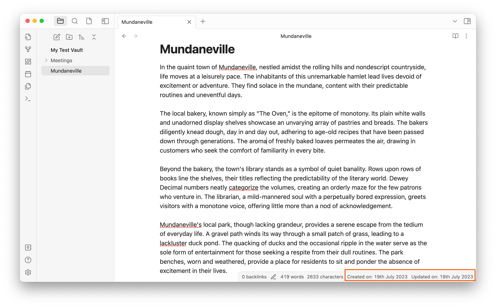

# Obsidian Notes dater 

An [obsidian.md](https://obsidian.md) plugin that adds the date that the active Obsidian file was created on and last updated on to the status bar.

The plugin adds the information highlighted in red in this image:

It works for all files including notes, images, and PDFs. 

If you have any feedback or feature requests please open an issue or email me to let me know. 

## Installing the plugin 
- Open Obsidian settings 
- Go to Community Plugins 
- Select Browse and search for Notes Dater
- Install the plugin
- Look through "Installed plugins" and enable Notes Dater (toggle)

## Manually installing the plugin

- Copy over `main.js` and `manifest.json` to your vault `/path/to/your/vault/.obsidian/plugins/your-plugin-id/`.
- Enable plugins in Obsidian settings
- Enable Note Dater in the Community Plugins tab

## Running the plugin in developer mode
- Clone the repo to the `/path/to/your/vault/.obsidian/plugins/` directory on your local machine
- Run `npm install` to install the dependencies
- Run `npm run dev` to start the plugin in developer mode
- Enable plugins in Obsidian settings
- Enable Note Dater in the Community Plugins tab

## Adding created_on and updated_on data to properties
To store the created_on and updated_on dates of notes in a note's property, you can select this option in the notes-dater plugin's settings. This will add the created_on and updated_on dates to the frontmatter of the note. 

This feature is especially useful if you are using Linux, as some Linux file systems do not store created_on and updated_on timestamps in file metadata. 

These properties will only be added to a note upon making a change to the note.

## License
[MIT](https://choosealicense.com/licenses/mit/)

## Contributing
Pull requests are welcome.

## Authors
[Paul Treanor](https://paultreanor.com)

[Nicolas Lienart](https://github.com/nicolnt)

