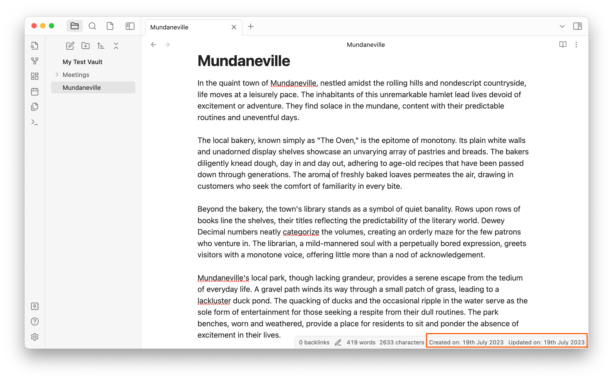

# Obsidian Notes dater 

An [obsidian.md](https://obsidian.md) plugin that adds the date that the active Obsidian file was created on and last updated on to the status bar.

The plugin adds the information highlighted in red in this image:

It works for all files including notes, images, and PDFs. 

If you have any feedback or feature requests please open an issue or email me to let me know. 

## Installing the plugin 
- Open Obsidian settings 
- Go to Community Plugins 
- Select Browse and search for Notes Dater
- Install the plugin
- Look through "Installed plugins" and enable Notes Dater (toggle)

## Manually installing the plugin
- Copy over `main.js` and `manifest.json` to your vault `/path/to/your/vault/.obsidian/plugins/your-plugin-id/`.
- Enable plugins in Obsidian settings
- Enable Note Dater in the Community Plugins tab

## Note on Linux file systems
On some Linux file systems, file creation time is not stored or reported, so the "Created on:" date may be missing. The plugin is desktop-only and reads file metadata without modifying your notes.

## License
[MIT](https://choosealicense.com/licenses/mit/)

## Contributing
I'm not accepting pull requests because this plugin is feature-complete, but feel free to fork this and make your own plugin!

## Author 
[Paul Treanor](https://paultreanor.com)

